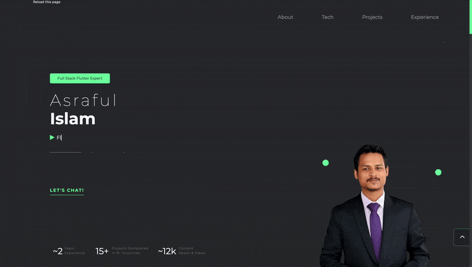
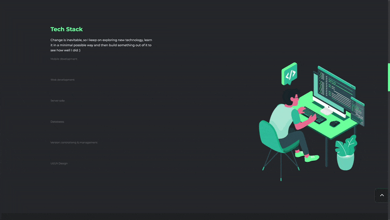
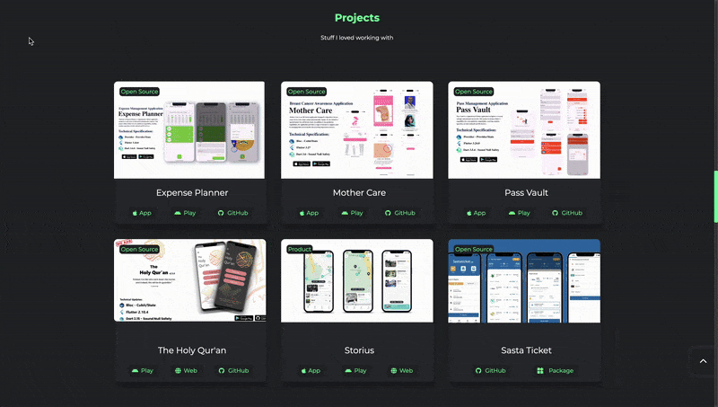
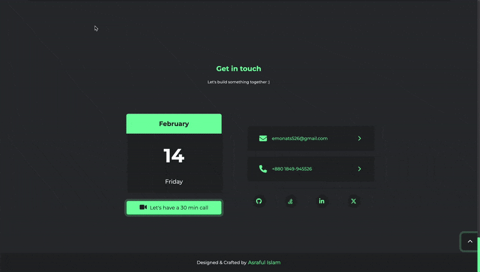

## Web Portfolio

### 💻 Live
Check the deployed version [here][live]

### 🎨 Design
Here's the [figma][design] design for inspiration and help.

### ⚒️ Tech Stack
Following is the tech stack for this:
- HTML (version 5)
- CSS (version 3)
- Bootstrap (version 5)
- JavaScript (ES6)

### 🙌🏻 Development environment
- You will be needing [Go live][go-live-link] extension in case you want to run this locally on VS Code.
- To set up the project locally:
  1. Clone the repository.
  2. Open the project folder in VS Code.
  3. Install the necessary extensions (e.g., Live Server).
  4. Open `index.html` file, make changes, and refresh the page to see the effect.

### 👀 Look'n Feel
Here is some look'n feel from the implementation

- The homepage showcases a responsive layout with a navigation bar and sections for projects, about, and contact.
- The GIFs below demonstrate the interactive features of the portfolio.

### 🔑 License
- This project is licensed under the MIT License - see the [LICENSE](LICENSE.md) file for details. Users are free to use, modify, and distribute the project as long as proper attribution is given.

### 🤝 Contribution
- Contributions are welcome! Please fork the repository and submit a pull request with your changes.

## 🧑 Author

#### Asrafu Islam

You can also follow my GitHub Profile to stay updated about my latest projects:

If you liked the repo then kindly support it by giving it a star ⭐

Copyright ©2025 ASRAFUL ISLAM

[live]: https://portfolio-cdfed.web.app/
[design]: https://www.figma.com/file/DpS8wyuqikqL0e4HlSbdG4/Portfolio-for-developers?node-id=0%3A1&t=ZYIuMAgcXoqQg65d-1
[go-live-link]: https://marketplace.visualstudio.com/items?itemName=ritwickdey.LiveServer
